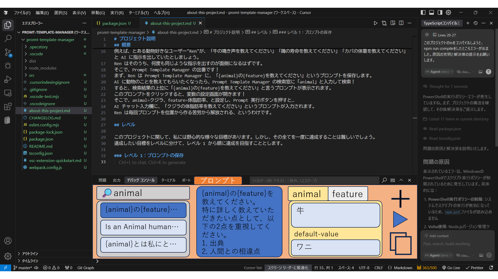

# プロジェクト説明

## 概要

このプロジェクトの名前は、Prompt Template Manager です。
このプロジェクトは、VS code の拡張機能開発を目的としています。
このプロジェクトの目的は、AI を使用した開発を快適にすることです。

目的を達成するために、このプロジェクトは主にの二つの機能をユーザーに提供します

1. プロンプトを保存すること
2. 保存してあるプロンプト内に変数を設定し、その変数をユーザーが自由に編集できること

上記機能について、分かりやすいように例え話をします。

例えば、とある動物好きなユーザー"Ren"が、「牛の鳴き声を教えてください」「鶏の寿命を教えてください」「カバの体重を教えてください」と AI に指示を出していたとしましょう。
Ren はそのうち、何度も同じような指示を出すのが面倒になるはずです。
そこで、Prompt Template Manager の出番です！
まず、Ren は Prompt Template Manager に、「{animal}の{feature}を教えてください」というプロンプトを保存します。
AI に動物のことを教えてもらいたくなったら、Prompt Template Manager の検索窓に「animal」と入力して検索！
すると、検索結果の上位に「{animal}の{feature}を教えてください」と言うプロンプトが表示されます。
このプロンプトをクリックすると、変数の設定画面が開きます！
そこで、animal=クジラ、feature=体脂肪率、と設定し、Prompt 実行ボタンを押すと…
AI チャット入力欄に、「クジラの体脂肪率を教えてください」というプロンプトが入力されます。
Ren は毎回プロンプトを位置から作る苦労から解放される、というわけです。

## 完成イメージ

このプロジェクトの完成イメージです。

## レベル

このプロジェクトに関して、私には野心的な様々な目標があります。しかし、その全てを一度に達成することは難しいでしょう。
達成したい目標をレベルに分けて、レベル 1 から順に達成を目指すこととします。

### レベル 1：プロンプトの保存

ユーザーは良く使うプロンプトを保存・編集することができます。
保存したプロンプトは上から使用回数順に並べられており、スクロールして目的のプロンプトを探すことができます。

## レベル 2：プロンプトの検索

ユーザーは数ある保存されたプロンプトの中から、検索によって目当てのものを探し出すことができます。

## レベル 3：プロンプトのコピー

ユーザーは保存されているプロンプトをボタン一つでコピーできる

## レベル 4：プロンプトの実行

ユーザーは保存されているプロンプトをボタン一つで AI のチャット欄に入力、送信ができる

## レベル 5：変数の定義

ユーザーはプロンプト内に変数を定義できる。
その変数には、自由に値を代入できます。
また、変数にユーザーが明示的に値を代入しなかった際には、自動的にデフォルトの値が代入されます。
そのデフォルトの値もユーザーが設定できます。

## レベル 6：

保存されているプロンプト内で指定されているファイルやフォルダ、インターネット上の文書のパスを適切に AI が読み取れる形式に置き換えて実行する

例：@挨拶.md を読んでください　 → 　## File:project/挨拶.md こんにちは！ を読んでください
